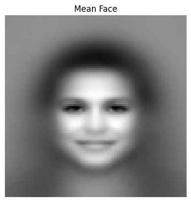
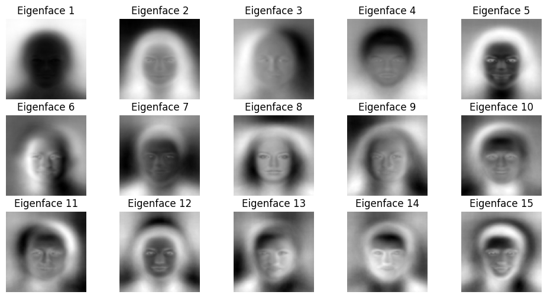

# 🎭 Eigenfaces Face Recognition using PCA

This project implements **Eigenfaces** for face recognition using **Principal Component Analysis (PCA)** in Python. The goal is to extract key facial features and represent them as Eigenfaces to understand and visualize how PCA captures the most important information in facial images.

---

## 📌 Overview

This project covers:
- Loading a dataset of facial images
- Preprocessing images (grayscale conversion, resizing)
- Computing the **Mean Face** from the dataset
- Applying **PCA** to extract the most important features
- Visualizing the **Eigenfaces**

---

## 🚀 Setup and Installation

1. Clone the repository:
   ```bash
   git clone https://github.com/yourusername/Eigenfaces-Face-Recognition.git
   cd Eigenfaces-Face-Recognition
   ```

## 📊 Results

### **Mean Face**

The **mean face** represents the average of all facial images in the dataset.



---

### **Top 10 Eigenfaces**

The **Eigenfaces** capture the principal components that best represent variations in the dataset.



---

## 🔑 Key Features

- PCA-based **Eigenface computation**
- Visualization of the **Mean Face** and **Eigenfaces**
- Ability to extend for **real-time face recognition** using OpenCV

---

## 📂 Project Structure

```bash
Eigenfaces-Face-Recognition/
├── eigenfaces.py         # Main code for Eigenfaces implementation
├── README.md             # Project documentation
├── mean_face.png         # Image of the computed Mean Face
├── Eigenfaces.png        # Visualization of the top Eigenfaces
└── images/               # Folder containing the dataset
```

---

## 📚 Theory: What are Eigenfaces?

Eigenfaces are a set of **eigenvectors** used in the computer vision problem of **facial recognition**. They are calculated by applying **PCA** to a dataset of facial images to capture the most important features that represent facial variations.

- **Mean Face:** The average of all facial images.
- **Eigenfaces:** The principal components (eigenvectors) that represent the key variations in the dataset.

---

## 🔗 Future Improvements

- Implement **real-time face recognition** using a webcam.
- Enhance accuracy using **Fisherfaces (LDA)**.
- Deploy as a **web app** using frameworks like Flask or Streamlit.

---

## 🛠️ Author
Developed by **[Your Name]**. Feel free to contribute or suggest improvements!
EOL
